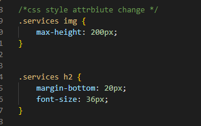
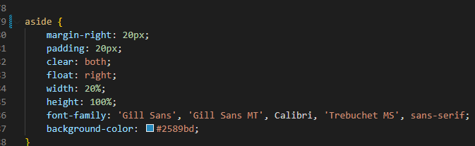

# <Module-one-Challenge>

## Description

Purpose is to complete the challenge provided by UTSA bootcamp and resolve the ask in the given criteria:
AS A marketing agency
I WANT a codebase that follows accessibility standards
SO THAT our own site is optimized for search engines
GIVEN a webpage meets accessibility standards
WHEN I view the source code
THEN I find semantic HTML elements
WHEN I view the structure of the HTML elements
THEN I find that the elements follow a logical structure independent of styling and positioning
WHEN I view the image elements
THEN I find accessible alt attributes
WHEN I view the heading attributes
THEN they fall in sequential order
WHEN I view the title element
THEN I find a concise, descriptive title

## Changes

The HTML text was changed to remove the DIV element with more apppropriate uses such as header,nav,main,footer and section to follow semantics and improve code
The site was not adjusted but only improved upon based on the new elements that were used
Some attributes were removed as the element alone was enough
 
I changed three lines of HTML that used different classes to one class called "services" to consolidate.
The same changes was made to the benefit, benefit h3 and benefit img to reduce the same contents into a single class
 
Elements that were changed were used to define the style and class were removed as it was not necessary for the change.
The modified code keeps the application intact without disrupting or changing the view and purpose of its original code
The end goal developed a cleaner code format and better optimization which can be located here:

## Credits 

The code used was pulled from GITLAB from UTSA Bootcamp and is located in the module-Challenge-One repository
